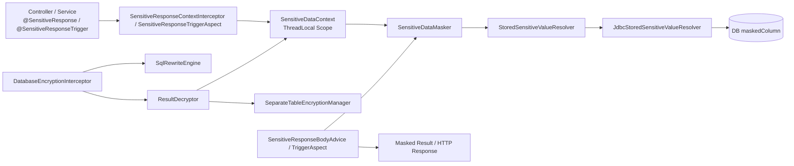
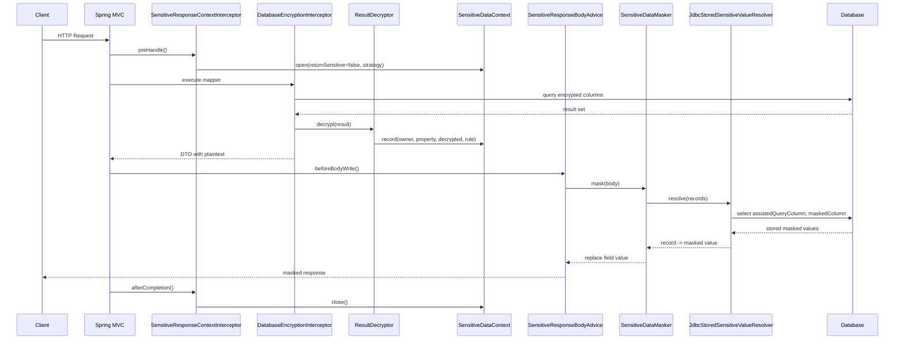
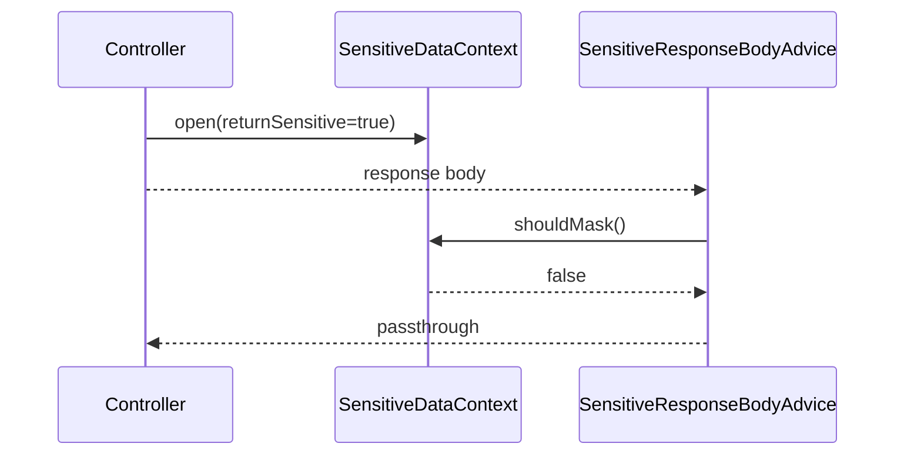

# 脱敏响应指南

## 这份文档适合什么时候看

这份文档适合你已经理解“字段如何加密、如何解密”，现在开始处理“接口最终该返回明文还是脱敏值”的阶段。

建议阅读顺序：

1. 先看 [快速使用指南](quick-start.zh-CN.md)
2. 再看 [持久层加密指南](persistence-encryption-guide.zh-CN.md)
3. 需要 controller 边界脱敏时，再看本文
4. 需要理解系统分层时，配合 [架构设计](architecture.md)

## 目标

本文说明控制器边界脱敏能力的设计、调用链路、配置方式、启动期校验和使用建议。

这套能力解决的是两个问题：

- 数据库存的是密文，运行时查询结果会先被插件解密成明文
- 但接口响应未必允许把明文直接返回给前端，因此需要在 controller 边界再次决策是否返回脱敏值

设计约束如下：

- 不改变现有 SQL 解密能力
- 不把脱敏逻辑下沉到业务 Service / Mapper
- 优先使用数据库中已经持久化的脱敏列，不在响应层重复推导
- 允许 controller 按接口维度声明“是否返回敏感信息”
- 保持同表模式与独立表模式一致

## 核心结论

1. 写入链路会在 `maskedColumn` 中持久化脱敏值。
2. 查询链路仍然只返回业务字段对应的密文字段，运行时先解密回 DTO 明文。
3. 如果 controller 标注了 `@SensitiveResponse` 且 `returnSensitive=false`，则在响应返回前统一做脱敏替换。
4. 只有 controller 上的 `@SensitiveResponse` 才负责打开响应脱敏上下文。
5. `@SensitiveResponseTrigger` 只能消费已经打开的上下文；没有上下文时不做任何操作。
6. 响应层优先从数据库存储态脱敏列回填；取不到时才回退到算法脱敏；再不满足时才落到 `@SensitiveField` 的对象图脱敏。

## 适用边界

适合：

- 手机号、身份证号、银行卡号、姓名、邮箱等敏感字段
- 同一个 DTO 既要支持内部明文处理，又要支持外部接口脱敏输出
- 希望脱敏策略由 controller 入口统一控制
- 希望在 service、导出组装或其它 Spring Bean 方法返回时复用 controller 已打开的脱敏上下文

不适合：

- 业务层已经直接返回数据库中的脱敏列，并且还对同字段再次加 `@SensitiveField`
- 需要基于调用方身份、租户、权限系统做复杂多级脱敏判定
- 响应字段不是 `String`

## 架构分层

### 1. 元数据层

- `@EncryptField`
  负责声明 `column`、`storageColumn`、`assistedQueryColumn`、`likeQueryColumn`、`maskedColumn`
- `EncryptMetadataRegistry`
  统一合并配置规则与注解规则，并在启动期做字段规则校验

### 2. 写入层

- `SqlInsertRewriter`
- `SqlUpdateSetRewriter`
- `SeparateTableReferencePreparer`
- `MigrationValueResolver`
- `JdbcMigrationRecordWriter`

职责：

- 写密文
- 写等值辅助列
- 写 LIKE 辅助列
- 写存储态脱敏列
- 处理同列复用冲突

### 3. 查询解密层

- `DatabaseEncryptionInterceptor`
- `ResultDecryptor`
- `QueryResultPlanFactory`
- `SeparateTableEncryptionManager`

职责：

- 改写查询 SQL
- 结果映射完成后按计划解密 DTO
- 把已解密的对象引用和字段记录到 `SensitiveDataContext`

### 4. 响应脱敏层

- `SensitiveResponseContextInterceptor`
- `SensitiveResponseBodyAdvice`
- `SensitiveDataContext`
- `SensitiveDataMasker`
- `StoredSensitiveValueResolver`
- `JdbcStoredSensitiveValueResolver`

职责：

- 在 controller 入口打开一次请求级脱敏上下文
- 在命中 `@SensitiveResponseTrigger` 的 service / 装配方法上复用当前线程里已打开的脱敏上下文
- 在响应写回前根据上下文与注解做最终脱敏替换

## 组件关系图



## 请求时序图

### 1. 默认脱敏返回链路



### 2. `returnSensitive=true` 链路



## 响应决策顺序

当 `@SensitiveResponse(returnSensitive = false)` 生效时，`SensitiveDataMasker` 按如下优先级处理：

1. 存储态脱敏值
   从 `maskedColumn` 查询数据库中已落库的脱敏值
2. 脱敏算法回退
   如果规则声明了 `maskedColumn` 但数据库未取到值，则使用 `maskedAlgorithm`
3. `@SensitiveField`
   若当前字段不在已记录解密引用中，则按注解遍历对象图做兜底脱敏

## 运行时策略

`@SensitiveResponse.strategy()` 支持 3 种模式：

- `RECORDED_ONLY`
  只处理已被 `ResultDecryptor` 记录过的对象字段
- `ANNOTATED_FIELDS`
  只遍历返回对象图，对 `@SensitiveField` 字段进行脱敏
- `RECORDED_THEN_ANNOTATED`
  先处理已记录字段，再对剩余 `@SensitiveField` 字段做补充脱敏

推荐：

- 标准查询接口用 `RECORDED_ONLY`
- 手工组装 DTO、无 MyBatis 解密记录的接口用 `ANNOTATED_FIELDS`
- 混合场景用 `RECORDED_THEN_ANNOTATED`

## DTO 映射与复杂 SQL 一致性

这一层最容易被误用，所以需要先明确一个总原则：

- 自动解密只保证“已经被 MyBatis 正确映射到结果对象上的字段”。
- 自动脱敏只保证“当前 controller 最终返回对象里，能够定位到的已解密字段或 `@SensitiveField` 字段”。
- 如果业务代码在 getter、装配器、切面或二次查询里又覆盖了字段值，框架不会追踪这类业务级副作用。

### 1. 推荐的一致性分层

1. SQL / ResultMap 负责把数据库结果稳定映射到 DTO。
2. `QueryResultPlanFactory` 负责识别“哪些 DTO 属性对应加密字段”。
3. `ResultDecryptor` 负责只对这些已映射属性原地解密，并记录对象引用。
4. `SensitiveDataMasker` 负责在 controller 边界按策略替换最终输出。

只要这四层边界不混淆，DTO 预期就稳定；一旦把业务二次查询、getter 动态改值、手工复制对象混进来，就应该显式切换到 `@SensitiveField` 或直接返回数据库中的脱敏列。

### 2. 场景矩阵

| 场景 | 是否推荐 | 自动解密 | 自动脱敏 | 建议 |
| --- | --- | --- | --- | --- |
| 单表 / 明确列投影 / 实体结果 | 推荐 | 稳定 | 稳定 | 默认 `RECORDED_ONLY` |
| `resultType` 为无注解 DTO，但别名仍可回溯来源列 | 推荐 | 稳定 | 稳定 | 必要时加 `@EncryptResultHint` |
| `resultMap` 嵌套对象 DTO | 推荐 | 稳定 | 稳定 | 由 `resultMap` 先完成对象装配 |
| join 扁平 DTO，别名完全脱离原列名 | 有条件推荐 | 取决于投影推断 | 取决于是否记录成功 | 显式别名 + `@EncryptResultHint` |
| 派生表 / 子查询包裹后仍是简单列透传 | 有条件推荐 | 大多可推断 | 大多可推断 | 保持别名稳定，不要混入复杂表达式 |
| union / set operation 多分支列来源不一致 | 不推荐依赖自动推断 | 保守处理 | 保守处理 | 显式返回脱敏列或拆查询 |
| 函数表达式、聚合值、拼接值 | 不承诺 | 不自动解密 | 不自动脱敏 | 业务显式处理 |
| getter 内部二次查库并覆盖属性 | 不允许依赖框架修正 | 可能被覆盖 | 可能失效 | 改造成纯 DTO getter |

### 3. `resultType` 无注解 DTO 的推荐写法

如果 DTO 本身没有 `@EncryptField`，但 SQL 投影仍来自已声明规则的实体表，推荐按下面顺序保持一致性：

1. 优先让投影别名与 DTO 属性名稳定对应。
2. 对多表 join / 派生表场景，在 Mapper 方法上补 `@EncryptResultHint(entities = ..., tables = ...)`。
3. 若返回的是嵌套对象图，不要只靠 `resultType`，应改用 `resultMap` 先完成对象装配。
4. 若字段已经是数据库里的 `maskedColumn`，就把它当最终输出字段，不要再期望解密后再脱敏。

示例：

```java
@EncryptResultHint(tables = "user_account")
List<UserFlatDto> selectUserFlats();
```

```xml
<select id="selectUserFlats" resultType="com.example.UserFlatDto">
    select u.phone as phone,
           u.id_card as id_card
    from user_account u
</select>
```

这里 DTO 即使没有加密注解，框架也能根据投影来源列和驼峰映射找到解密规则。

### 4. 复杂 SQL 的保守边界

以下情况应视为“超出自动一致性承诺范围”：

- 多层嵌套 derived table 中列被重复改名，且无法从最终投影唯一回溯来源列。
- `union` / `union all` 多分支对同一别名映射到不同来源字段。
- `concat(phone, '-', suffix)`、`substr(id_card, ...)` 这类表达式列。
- 业务返回对象不是 MyBatis 原始结果对象，而是中途复制、过滤、二次查询后的新对象。

应对方式只有三类，按优先级排序：

1. 直接查询并返回存储态脱敏列。
2. 用简单 SQL 拆成两步查询，保证解密与脱敏链路可预测。
3. 对最终 DTO 显式使用 `@SensitiveField`，把它视为 controller 输出模型，而不是数据库结果模型。

## 边界与职责

### 1. SQL 层职责

- 负责改写写入 / 查询 SQL。
- 负责让加密字段能写入密文、辅助列和存储态脱敏列。
- 不负责业务 DTO 的二次组装，也不负责根据接口权限决定是否返回明文。

### 2. 结果解密层职责

- 负责对 MyBatis 已映射完成的对象属性原地解密。
- 负责把“对象引用 + 属性名 + 明文值 + 规则”记录进 `SensitiveDataContext`。
- 不负责遍历业务层后续复制出来的新对象。

### 3. 响应脱敏层职责

- 负责在 controller 边界做最终输出替换。
- 优先返回数据库中的存储态脱敏值。
- 不负责推断复杂业务权限，也不负责回写模型或数据库。

### 4. 业务层职责

- 保持 getter / assembler 纯净，不在取值过程中触发二次查库并覆盖原属性。
- 对复杂聚合 DTO 明确选择：
  - 要么让 SQL 投影保持可推断；
  - 要么直接把 DTO 视为输出模型，用 `@SensitiveField` 管理。

## 最简使用决策

如果你希望接入方式尽量简单，推荐只在团队里保留下面 3 种固定模式：

### 模式 A：标准查询接口

适用：

- 返回对象直接来自 MyBatis 查询结果
- SQL 投影不复杂
- 想要最低性能成本和最清晰职责

做法：

1. 字段声明 `maskedColumn` 和 `maskedAlgorithm`
2. controller 或 controller 类上标 `@SensitiveResponse`
3. 保持默认 `RECORDED_ONLY`

这是默认推荐模式。

### 模式 B：复杂 SQL 扁平 DTO

适用：

- join / 派生表 / DTO 别名映射
- DTO 本身没有加密注解

做法：

1. 保持投影列来源清晰
2. 必要时在 Mapper 方法上标 `@EncryptResultHint`
3. controller 仍然使用 `@SensitiveResponse`

如果别名已经完全不可回溯，直接改成模式 C。

### 模式 C：输出模型脱敏

适用：

- controller 返回的是手工组装 DTO
- SQL 或业务逻辑已经不适合再依赖自动解密记录

做法：

1. 在输出 DTO 的 `String` 字段上标 `@SensitiveField`
2. controller 上使用 `@SensitiveResponse(strategy = ANNOTATED_FIELDS)` 或 `RECORDED_THEN_ANNOTATED`

这时要把 DTO 当输出模型，不再要求它与数据库结果模型完全同构。

## 线程与异步边界

### 1. 同线程多 invocation

当前 `SensitiveDataContext` 和 MVC interceptor 都按栈维护 scope：

- 同一线程内允许嵌套多个 controller invocation
- 后进入的 scope 先关闭
- 不会再因为 request attribute 被覆盖而把外层 scope 遗留在线程中

### 2. 异步请求

当前异步 MVC continuation 的策略是：

- `afterConcurrentHandlingStarted` 时关闭当前 scope
- 不自动把 scope 传播到异步线程

这表示异步链路默认是新的边界。如果业务需要跨线程保持脱敏上下文，应显式设计上下文传播，而不是继续依赖隐式 `ThreadLocal`。

## 配置模型

### 0. 新手推荐顺序

如果你第一次接这个能力，建议按下面顺序用，尽量不要一开始就上复杂 DTO：

1. 先给字段补 `maskedColumn` 和 `maskedAlgorithm`。
2. 对外 controller 直接加 `@SensitiveResponse`。
3. 只有在返回对象不是 MyBatis 原始结果对象时，才再考虑 `@SensitiveField`。
4. 只有在内置掩码规则不够时，才再考虑 `likeAlgorithm` 或 `masker`。

这样职责最清晰，也最不容易踩 DTO 映射和复杂 SQL 的边界。

### 1. `@EncryptField`

最关键的新增属性：

```java
@EncryptField(
        column = "phone",
        storageColumn = "phone_cipher",
        assistedQueryColumn = "phone_hash",
        likeQueryColumn = "phone_like",
        likeQueryAlgorithm = "phoneMaskLike",
        maskedColumn = "phone_masked",
        maskedAlgorithm = "phoneMaskLike"
)
private String phone;
```

字段含义：

- `likeQueryColumn`
  面向 LIKE 查询的辅助列
- `maskedColumn`
  面向接口返回的存储态脱敏列
- `maskedAlgorithm`
  在写入和迁移时生成 `maskedColumn` 的算法

### 2. 同列复用规则

如果希望 `likeQueryColumn` 和 `maskedColumn` 复用同一物理列，可以这样配置：

```java
@EncryptField(
        column = "phone",
        storageColumn = "phone_cipher",
        assistedQueryColumn = "phone_hash",
        likeQueryColumn = "phone_like",
        likeQueryAlgorithm = "phoneMaskLike",
        maskedColumn = "phone_like",
        maskedAlgorithm = "phoneMaskLike"
)
private String phone;
```

行为规则：

- 两个属性指向同一列时，写入链路只写一次
- migration / insert / update 不会再生成重复列
- 两者必须配置为同一算法

### 3. `@SensitiveResponse`

可标注在 controller 类或方法上：

```java
@SensitiveResponse
@GetMapping("/users/{id}")
public UserDto detail(@PathVariable Long id) {
    return userService.detail(id);
}
```

返回明文：

```java
@SensitiveResponse(returnSensitive = true)
@GetMapping("/internal/users/{id}")
public UserDto internalDetail(@PathVariable Long id) {
    return userService.detail(id);
}
```

指定策略：

```java
@SensitiveResponse(strategy = SensitiveResponseStrategy.RECORDED_THEN_ANNOTATED)
```

`@SensitiveResponse` 属性速查：

| 属性 | 默认值 | 作用 | 什么时候改 |
| --- | --- | --- | --- |
| `returnSensitive` | `false` | 是否允许接口直接返回明文 | 内部接口、管理接口确实需要明文时 |
| `strategy` | `RECORDED_ONLY` | 响应脱敏策略 | 返回手工 DTO 或混合对象图时 |

### 3.1 `@SensitiveResponseTrigger`

当一个 controller 已经通过 `@SensitiveResponse` 打开了脱敏上下文，而你又希望某个 service、导出组装或局部方法在返回前先消费这份上下文时，可以在该方法上追加触发注解：

```java
@RestController
@RequestMapping("/users")
@SensitiveResponse
public class UserController {

    @GetMapping("/export")
    public ExportView export() {
        return userService.export();
    }
}
```

也可以直接用于 service / 组装方法：

```java
@Service
public class ExportAssembler {

    @SensitiveResponseTrigger
    public ExportView build(UserAccount account) {
        return new ExportView(account.getPhone());
    }
}
```

行为规则：

- `@SensitiveResponseTrigger` 本身不会打开 `SensitiveDataContext`
- 只有当前线程已经存在由 controller `@SensitiveResponse` 打开的上下文时，它才会对方法返回值执行一次 `SensitiveDataMasker.mask(...)`
- 没有上下文时，它完全透传，不会自行决定策略，也不会创建额外 scope
- controller 方法是否开启上下文、是否允许明文、使用什么策略，仍然只由 `@SensitiveResponse` 决定
- 如果某个入口方法本身就需要决定 `returnSensitive` 或完整覆盖策略，仍然直接在方法上使用 `@SensitiveResponse`
- 对同一个 Spring Bean 内部的 `this.xxx()` 自调用，标准 Spring AOP 代理不会拦截；这类内部方法如需自动触发，需要改成经代理调用或启用 AspectJ weaving

### 4. `@SensitiveField`

对于不是由解密链路直接返回的字段，可以加在响应 DTO 上：

```java
public class UserView {

    @SensitiveField(type = SensitiveMaskType.PHONE)
    private String phone;

    @SensitiveField(type = SensitiveMaskType.ID_CARD)
    private String idCard;
}
```

注意：

- 只能用于 `String` 字段
- `static` / `final` 字段会在启动期直接失败
- 如果字段本身已经是数据库中的脱敏值，通常不应再加 `@SensitiveField`

`@SensitiveField` 属性速查：

| 属性 | 默认值 | 作用 | 典型场景 |
| --- | --- | --- | --- |
| `type` | `AUTO` | 内置掩码类型 | 手机号、姓名、邮箱等常见字段 |
| `keepFirst` | `-1` | 覆盖保留前缀位数 | 默认规则不满足展示要求时 |
| `keepLast` | `-1` | 覆盖保留后缀位数 | 默认规则不满足展示要求时 |
| `maskChar` | `*` | 掩码字符 | 想改成 `#`、`x` 等字符时 |
| `masker` | 空 | 自定义脱敏器 Bean 名 | 业务展示规则特殊 |
| `likeAlgorithm` | 空 | 复用已有 LIKE 脱敏算法 | 想和 `maskedAlgorithm` 保持完全一致 |
| `options` | 空数组 | 传给自定义脱敏器的 `key=value` 参数 | 少量字段级定制参数 |

#### 4.1 优先级

`@SensitiveField` 有 3 种执行方式，优先级从高到低如下：

1. `masker`
   走自定义 `SensitiveFieldMasker` Bean
2. `likeAlgorithm`
   直接复用已经注册的 `LikeQueryAlgorithm`
3. 内置规则
   `type / keepFirst / keepLast / maskChar`

也就是说，只要声明了 `masker`，就不会再回退到 `likeAlgorithm` 或内置规则。

#### 4.2 复用 `likeAlgorithm`

如果你的接口返回规则应该和 `maskedAlgorithm` 或现有 LIKE 脱敏算法完全一致，可以直接这样写：

```java
public class UserView {

    @SensitiveField(likeAlgorithm = "phoneMaskLike")
    private String phone;
}
```

适合：

- 手机号、身份证号、银行卡号这类已经有成熟 `LikeQueryAlgorithm` 的字段
- 希望响应脱敏和写入 `maskedColumn` 的算法保持完全一致

#### 4.3 自定义 `masker`

先声明一个 Spring Bean：

```java
@Component("prefixMasker")
public class PrefixSensitiveFieldMasker implements SensitiveFieldMasker {

    @Override
    public String mask(String value, SensitiveFieldMaskingContext context) {
        String prefix = context.option("prefix");
        int keepLast = Integer.parseInt(context.option("keepLast"));
        return prefix + value.substring(Math.max(0, value.length() - keepLast));
    }
}
```

再在 DTO 上引用：

```java
public class UserView {

    @SensitiveField(
            masker = "prefixMasker",
            options = {"prefix=ID:", "keepLast=4"}
    )
    private String phone;
}
```

说明：

- `options` 必须使用 `key=value`
- 空 key、重复 key、未写 `=` 都会直接报错
- 自定义脱敏器只应该处理“输出值怎么显示”，不要在里面做查库或写库

#### 4.4 什么时候该用哪一种

- 能用 `maskedColumn` 就优先用 `maskedColumn`
- 能复用现有 `likeAlgorithm` 就不要先写自定义 `masker`
- 只有当字段展示规则和内置 / LIKE 算法都不匹配时，才写 `SensitiveFieldMasker`

### 5. Spring Boot 开关

默认开启：

```yaml
mybatis:
  encrypt:
    sensitive-response:
      enabled: true
```

关闭后：

- 不注册 `SensitiveResponseContextInterceptor`
- 不注册 `SensitiveResponseBodyAdvice`
- 不注册 `SensitiveDataMasker`

## 使用方式

### 场景一：同表模式

数据库字段：

- `phone`
- `phone_cipher`
- `phone_hash`
- `phone_like`
- `phone_masked`

实体：

```java
@EncryptTable("user_account")
public class UserAccount {

    private Long id;

    @EncryptField(
            column = "phone",
            storageColumn = "phone_cipher",
            assistedQueryColumn = "phone_hash",
            likeQueryColumn = "phone_like",
            maskedColumn = "phone_masked",
            maskedAlgorithm = "phoneMaskLike"
    )
    private String phone;
}
```

Controller：

```java
@RestController
@RequestMapping("/users")
public class UserController {

    private final UserMapper userMapper;

    public UserController(UserMapper userMapper) {
        this.userMapper = userMapper;
    }

    @SensitiveResponse
    @GetMapping("/{id}")
    public UserAccount detail(@PathVariable Long id) {
        return userMapper.selectById(id);
    }
}
```

返回行为：

- MyBatis 结果先解密为明文手机号
- 响应阶段从 `phone_masked` 取值
- 最终接口返回脱敏手机号

### 场景二：独立表模式

主表：

- `user_account.id`
- `user_account.id_card`

独立表：

- `user_id_card_encrypt.id`
- `user_id_card_encrypt.id_card_cipher`
- `user_id_card_encrypt.id_card_hash`
- `user_id_card_encrypt.id_card_like`
- `user_id_card_encrypt.id_card_masked`

实体：

```java
@EncryptField(
        column = "id_card",
        storageMode = FieldStorageMode.SEPARATE_TABLE,
        storageTable = "user_id_card_encrypt",
        storageColumn = "id_card_cipher",
        storageIdColumn = "id",
        assistedQueryColumn = "id_card_hash",
        likeQueryColumn = "id_card_like",
        maskedColumn = "id_card_masked",
        maskedAlgorithm = "idCardMaskLike"
)
private String idCard;
```

返回行为：

- 查询结果先通过独立表回填明文身份证
- `SensitiveDataMasker` 再根据 `id_card_hash` 去独立表读取 `id_card_masked`

### 场景三：手工组装 DTO

如果 controller 返回的对象不是直接来自 MyBatis 解密对象，而是手工复制后的视图对象：

```java
public class UserView {

    @SensitiveField(type = SensitiveMaskType.PHONE)
    private String phone;
}
```

```java
@SensitiveResponse(strategy = SensitiveResponseStrategy.ANNOTATED_FIELDS)
```

此时即使没有 `SensitiveDataContext.record(...)` 记录，仍然会通过对象图遍历进行脱敏。

### 场景四：手工组装 DTO 但直接复用 LIKE 脱敏算法

```java
public class UserView {

    @SensitiveField(likeAlgorithm = "phoneMaskLike")
    private String phone;
}
```

适合：

- 该字段在写入期和响应期都应该保持同一口径
- 你不希望再额外维护一套 DTO 层脱敏实现

### 场景五：需要传额外参数的自定义 DTO 脱敏

```java
@Component("customerCodeMasker")
public class CustomerCodeMasker implements SensitiveFieldMasker {

    @Override
    public String mask(String value, SensitiveFieldMaskingContext context) {
        String prefix = context.option("prefix");
        int visible = Integer.parseInt(context.option("visible"));
        return prefix + value.substring(Math.max(0, value.length() - visible));
    }
}
```

```java
public class CustomerView {

    @SensitiveField(
            masker = "customerCodeMasker",
            options = {"prefix=VIP-", "visible=3"}
    )
    private String customerCode;
}
```

适合：

- 某些字段展示规则和手机号/身份证号这类通用掩码完全不同
- 需要按字段声明少量可配置参数，但又不希望在 DTO 里写业务逻辑

## 启动期校验

### 1. 共享派生列算法一致性校验

如果 `likeQueryColumn` 与 `maskedColumn` 复用同一物理列，但算法不同，启动期直接失败：

错误码：

- `SHARED_DERIVED_COLUMN_ALGORITHM_MISMATCH`

错误信息：

```text
likeQueryColumn and maskedColumn share the same physical column but use different algorithms.
property=phone, table=user_account, column=phone, sharedColumn=phone_like,
likeQueryAlgorithm=phoneMaskLike, maskedAlgorithm=normalizedLike.
Configure the same algorithm for both roles.
```

修复方式：

- 要么拆成两个物理列
- 要么把 `maskedAlgorithm` 改成与 `likeQueryAlgorithm` 相同

### 2. `@SensitiveField` 非法字段校验

以下场景也会在运行期首次构建掩码绑定时直接失败：

- 字段不是 `String`
- 字段是 `static`
- 字段是 `final`
- `options` 不是 `key=value`
- `options` 出现重复 key

对应错误码：

- `INVALID_FIELD_RULE`

如果声明了不存在的自定义脱敏器 Bean，也会直接失败：

- `MISSING_SENSITIVE_FIELD_MASKER`

### 3. 独立表规则缺失校验

如果字段配置了 `SEPARATE_TABLE`，但缺少关键列，也会在启动期或首次元数据加载时失败，例如：

- `MISSING_STORAGE_TABLE`
- `MISSING_ASSISTED_QUERY_COLUMN`

## 性能说明

### 1. 为什么优先取数据库中的 `maskedColumn`

原因：

- 响应层不重复发明脱敏规则
- 同一个字段的写入值、迁移值、响应值保持一致
- 规避业务层再做一次字符串处理带来的口径漂移

### 2. 当前优化点

- `SensitiveDataContext` 只记录已解密的对象引用，不全图扫描
- `JdbcStoredSensitiveValueResolver` 按 `dataSource + table + rule` 分组批量查询
- 同列复用时只生成一次派生值、只写一次 SQL 列
- `SensitiveDataMasker` 对 `@SensitiveField` 绑定结果做缓存

### 3. 性能边界

以下场景成本更高：

- 一个响应里包含大量不同表、不同规则的敏感对象
- 使用 `ANNOTATED_FIELDS` 对非常深的对象图进行遍历
- 一个接口同时返回多批手工组装 DTO 和直接解密 DTO

## 最佳实践

1. 对标准查询接口优先使用 `RECORDED_ONLY`。
2. `maskedColumn` 尽量在写入和迁移阶段一次性落库，不要在响应层临时拼装。
3. 如果 `likeQueryColumn` 与 `maskedColumn` 复用同一列，显式配置相同算法。
4. 已经从数据库直接取到脱敏字段的 DTO，不要再额外用 `@SensitiveField` 二次脱敏。
5. 对外接口和内部接口分开 controller 注解，避免在运行时做复杂分支判断。
6. getter / setter / assembler 保持纯净，不要在读取属性时触发额外查库或覆盖字段值。
7. 对复杂 SQL，优先先让结果映射可预测，再谈自动解密与自动脱敏；不要把框架当作运行时猜测器。

## 相关类

- `common`
  - `io.github.jasper.mybatis.encrypt.annotation.SensitiveResponse`
  - `io.github.jasper.mybatis.encrypt.annotation.SensitiveResponseTrigger`
  - `io.github.jasper.mybatis.encrypt.annotation.SensitiveField`
  - `io.github.jasper.mybatis.encrypt.core.mask.SensitiveDataContext`
  - `io.github.jasper.mybatis.encrypt.core.mask.SensitiveDataMasker`
  - `io.github.jasper.mybatis.encrypt.core.mask.JdbcStoredSensitiveValueResolver`
- `spring2-starter`
  - `SensitiveMaskingAutoConfiguration`
  - `SensitiveResponseAutoConfiguration`
  - `SensitiveResponseTriggerAspect`
  - `SensitiveResponseContextInterceptor`
  - `SensitiveResponseBodyAdvice`
- `spring3-starter`
  - `SensitiveMaskingAutoConfiguration`
  - `SensitiveResponseAutoConfiguration`
  - `SensitiveResponseTriggerAspect`
  - `SensitiveResponseContextInterceptor`
  - `SensitiveResponseBodyAdvice`
